# Crear Pruebas en AzureDevOps Metropolitan Touring QA

## Índice de Contenidos
<procedure>
    <step>
        
<a href="#devops-intro">DevOps Introducción</a>

    </step>
    <step>
        
<a href="#quedevops">Qué son los tests en Azure DevOps</a>

    </step>
    <step>
        
<a href="#crear">Crear un Test en Azure DevOps</a>

    </step>
    <step>
        
<a href="#crearMasivos">Crear Tests masivos en Azure DevOps</a>

    </step>
    <step>
        
<a href="#masivos">Importar Tests masivos en Azure DevOps</a>

    </step>
    <step>
        
<a href="#correr">Cómo Correr un Test en Azure DevOps</a>

    </step>
</procedure>

## DevOps Introducción {id="devops-intro"}
**Azure DevOps** es un conjunto completo de servicios que capacita a los equipos de desarrollo y operaciones para colaborar eficientemente, ofreciendo un espacio centralizado para compartir código, realizar un seguimiento detallado del trabajo y desplegar software de manera integral. Entre sus funcionalidades, Azure DevOps incorpora repositorios privados de Git, un sistema de compilación CI/CD, tableros Kanban, seguimiento de problemas, y una gama amplia de herramientas adicionales.

En **Metropolitan Touring QA**, aprovechamos las capacidades de Azure DevOps para la creación y ejecución de pruebas automatizadas. Este entorno nos brinda la posibilidad de revisar minuciosamente los resultados de las pruebas y generar informes detallados que respaldan nuestras evaluaciones.

Dentro del ámbito de QA, Azure DevOps se convierte en una herramienta esencial para la gestión de bugs, permitiéndonos revisar estados, crear nuevos informes de errores, asignar tareas y llevar a cabo diversas actividades relacionadas. Además, QA asume la responsabilidad de generar historias de usuario y tareas en Azure DevOps en el contexto de la implementación de nuevos procesos.

A continuación, se presenta una representación gráfica de la interfaz de Azure DevOps, destacando la importancia de esta plataforma en nuestros procesos:

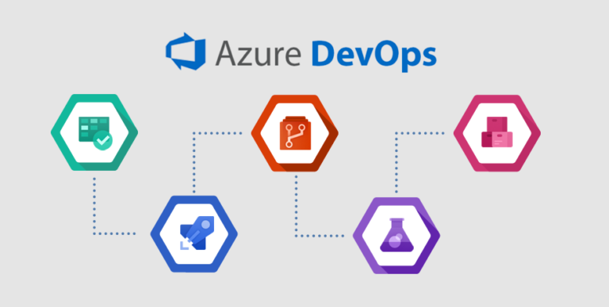

## Qué son los tests en Azure DevOps {id="quedevops"}
Los tests en Azure DevOps constituyen una serie de pasos ejecutados en el entorno de Azure DevOps, pudiendo ser realizados de manera manual o automática.

En la actualidad, en Metropolitan Touring QA, empleamos los tests de Azure DevOps para llevar a cabo pruebas manuales, las cuales son ejecutadas por los testers de QA. Estos tests tienen como objetivo validar que los procesos, aplicaciones y/o funcionalidades de los sistemas de Metropolitan Touring funcionen correctamente. Es imperativo que todos los tests se encuentren en estado **"Passed"** para autorizar la liberación de una funcionalidad a producción.

En caso de que un test falle, el tester de QA debe generar un informe de bug en Azure DevOps y asignarlo al equipo de desarrollo para su resolución. El equipo de desarrollo se encarga de cambiar el estado del bug a **"Resolved for QA"** y asignarlo al tester de QA para su validación. Una vez que el bug ha sido resuelto, el tester de QA debe ejecutar nuevamente TODOS los tests y verificar que el bug haya sido correctamente solucionado.

**Nota: Es crucial identificar el siguiente logotipo, ya que se utiliza para reconocer los tests en Azure DevOps. Posteriormente, se presenta la interfaz de Azure DevOps y se detalla el proceso de creación de un test paso a paso.**

## Crear un Test en Azure DevOps {id="crear"}

La creación de un test en Azure DevOps es un proceso fundamental que permite definir y estructurar las pruebas que serán ejecutadas en el entorno. A continuación, se presenta una guía paso a paso sobre cómo llevar a cabo este procedimiento:

<procedure>
<step>
    
Acceso a Azure DevOps: Inicie sesión en Azure DevOps y navegue hasta el proyecto o repositorio donde desea crear el test.

    <a href="https://dev.azure.com/MetropolitanTouring/">Iniciar Sesión</a>
</step>
<step>
    
Elegir un proyecto: En la interfaz de Azure DevOps, seleccione el proyecto o repositorio donde desea crear el test.

    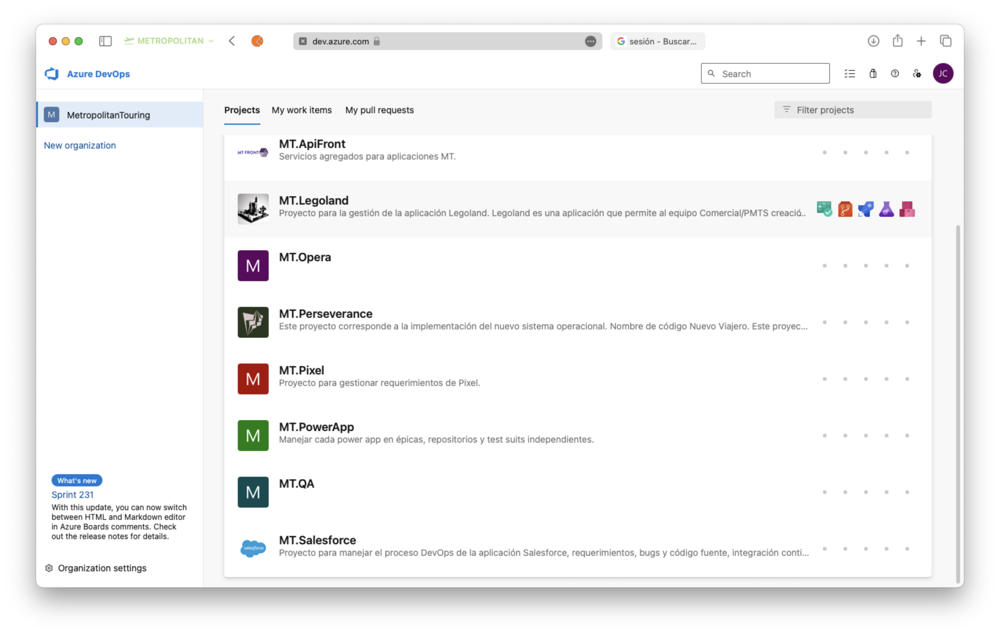
</step>
<step>
    
Menú de Pruebas: En la interfaz de Azure DevOps, diríjase al menú específico de pruebas, que generalmente se encuentra en la sección de "Pruebas" o "Test Plans".

    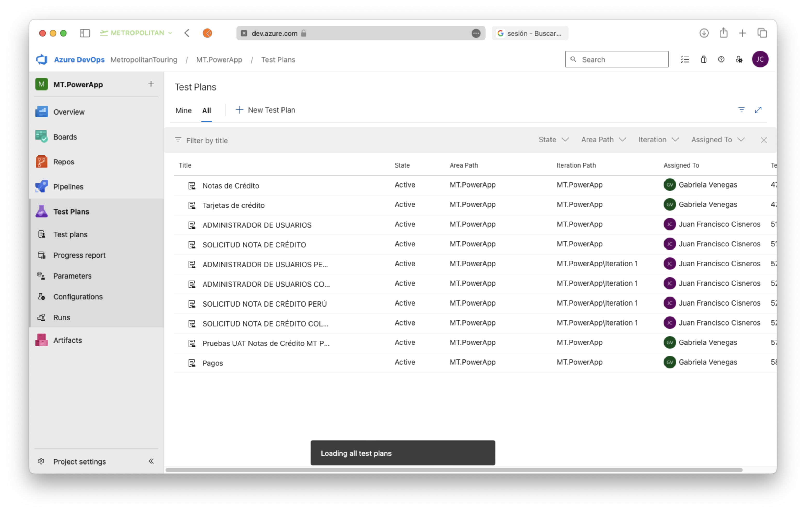
</step>
<step>
    
Crear un nuevo test: En la interfaz de Azure DevOps, seleccione la opción "Nuevo Plan de Pruebas" para crear un nuevo test.

    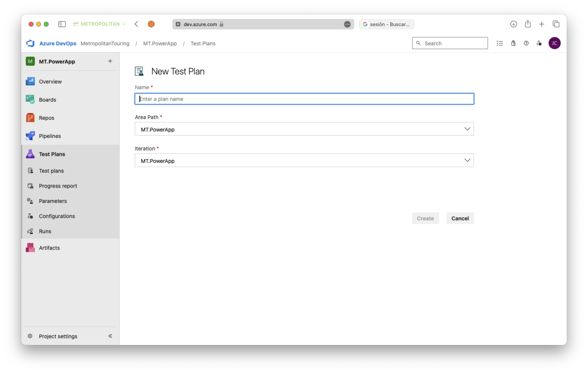
    
Se debe ingresar un nombre, un Area Path y un Iteration Path para el test. El Area Path y el Iteration Path deben coincidir con el nombre del proyecto o repositorio.

</step>
<step>
    
Test Suite: En la interfaz de Azure DevOps, seleccione la opción "Nueva Suite de Pruebas" para crear una nueva suite de pruebas.Por defecto se crea una suite de pruebas 

    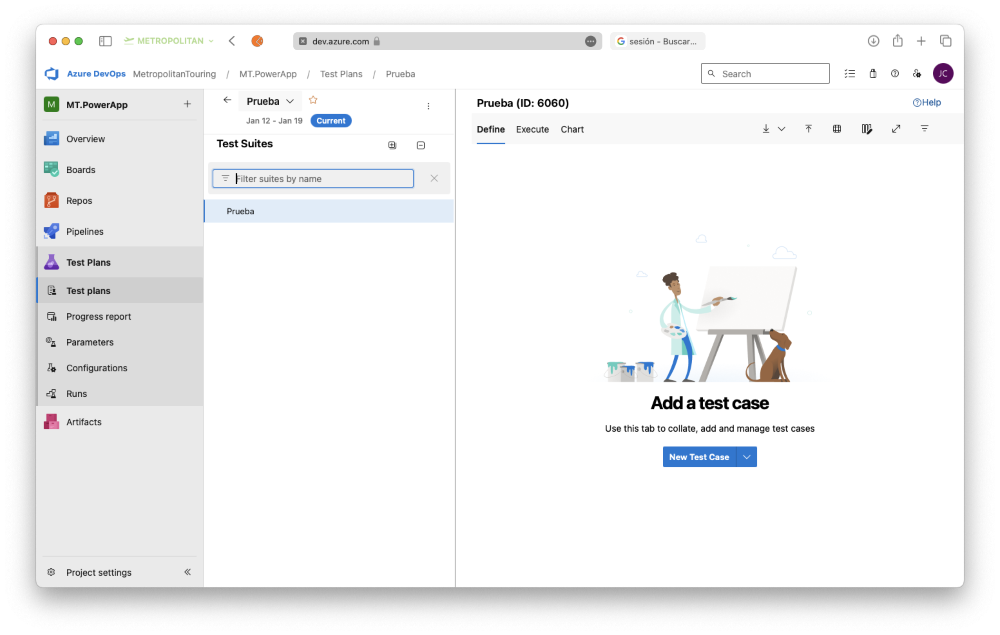
</step>
<step>
    
Dentro de un suite de pruebas se pueden entonces comenzar a crear los tests (New Test Case).

    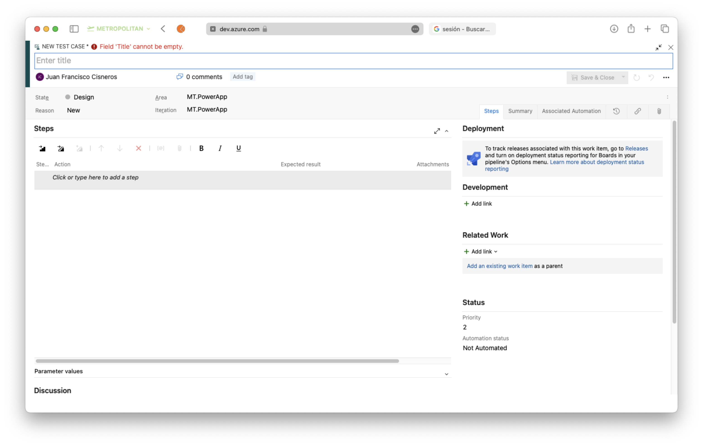
    
Se debe ingresar un título, asignar un tester, y crear un paso a paso de los pasos que se deben seguir para realizar la prueba.

</step>
<step>
    
Guardar el test y crear tantos como sean necesarios

</step>
</procedure>

## Crear Tests masivos en Azure DevOps {id="crearMasivos"}
<procedure>
<step>
    
Para crear tests masivos debemos descargar el template

    <a href="https://juanfranciscocis.github.io/Documentation/starter.html#correr" alt="6">Descargar Template</a>
</step>
<step>
    
Una vez descargado el template debemos abrirlo en Excel

    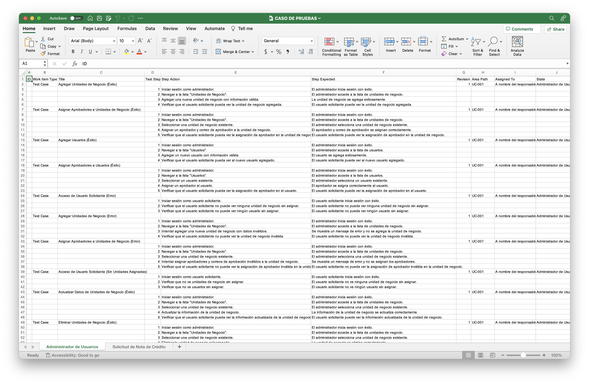
</step>
<step>
    
Modificamos el template con los datos de los tests que queremos crear

</step>
<step>
    
Una vez que el template ha sido modificado debemos guardarlo como un archivo CSV

</step>
</procedure>

**Nota: Se adjunta una web con mayor detalle sobre la creación de tests masivos en Azure DevOps.**
[Ir a la Referencia](https://ecanarys.com/bulk-export-import-test-cases-to-azure-devops-test-plans-using-csv-file/)

## Importar Tests masivos en Azure DevOps {id="masivos"}
<procedure>
<step>
    
Para crear tests masivos debemos encontrarnos dentro de un Test Plan y dentro de una Suite en el menú "Define"

    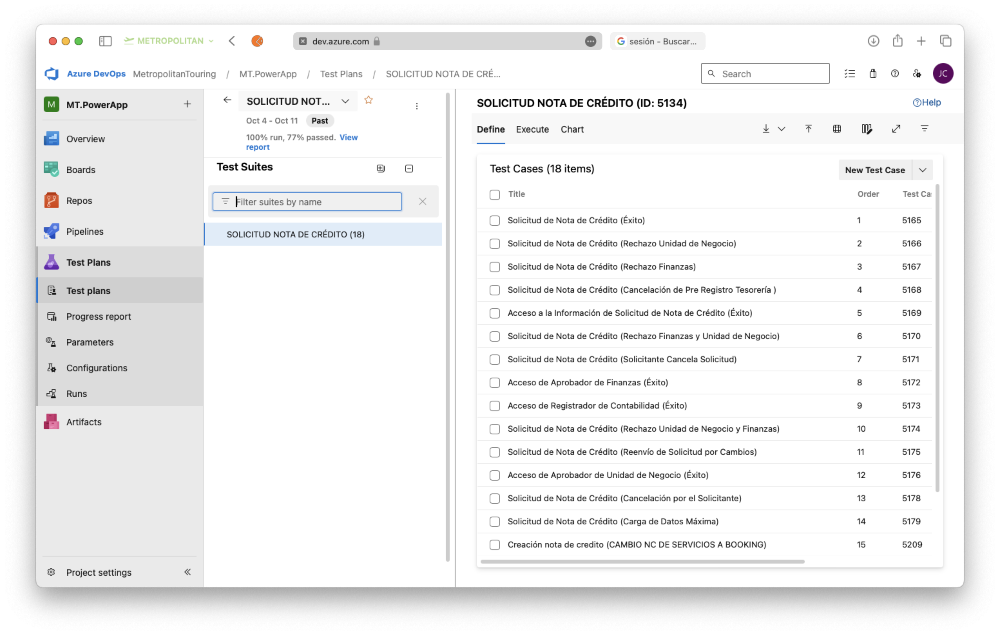
</step>
<step>
    
Seleccionamos el menú de importación

    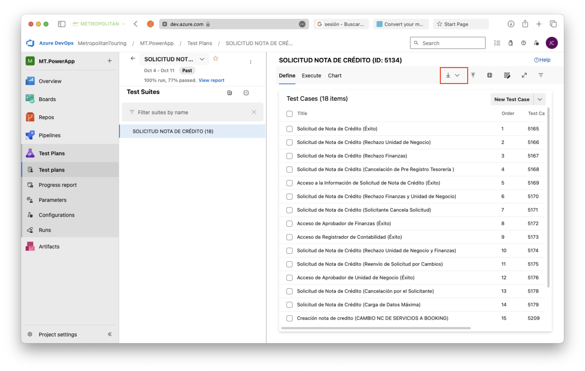
</step>
<step>
    
Seleccionamos la opción "Import from CSV"

    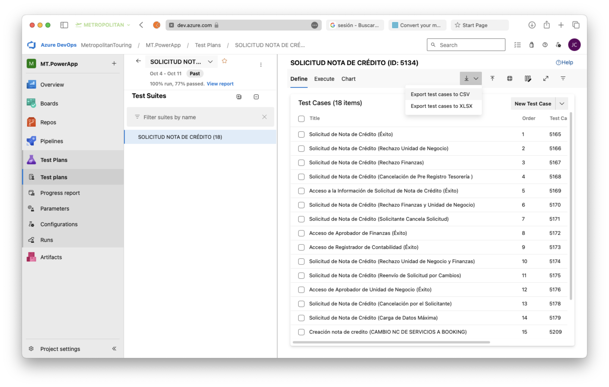
</step>
<step>
    
 Se abre el explorador de archivos y seleccionamos el archivo CSV que contiene los tests que queremos importar

</step>
</procedure>

## Cómo Correr un Test en Azure DevOps {id="correr"}
<procedure>
<step>
    
Para correr un test debemos encontrarnos dentro de un Test Plan y dentro de una Suite

    
</step>
<step>
    
Seleccionamos "Execute" y se nos abrirá una ventana donde podremos ver los tests que se encuentran dentro de la suite listos para ser ejecutados

    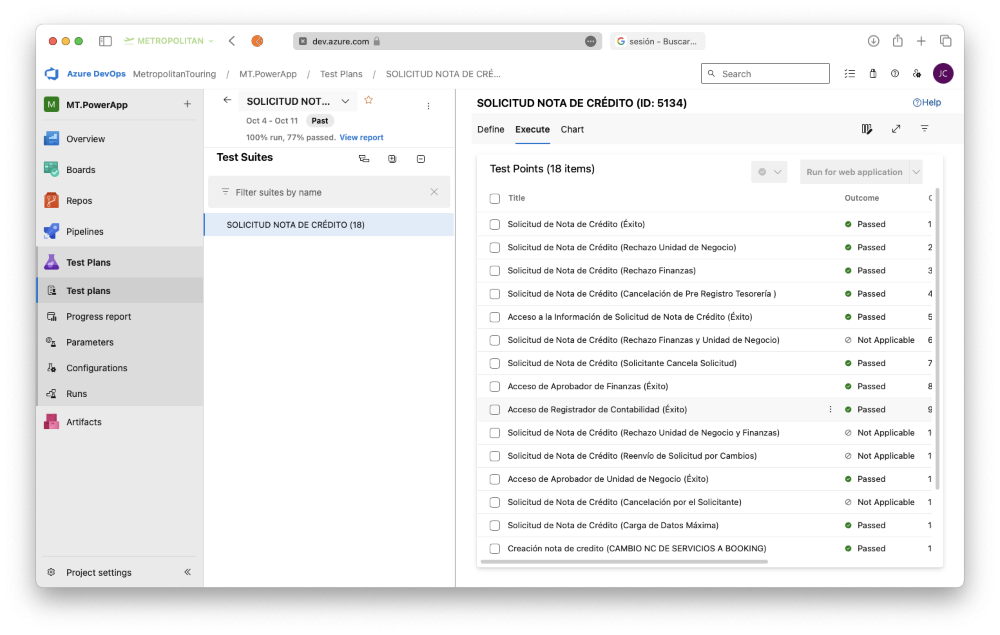
</step>
<step>
    
Seleccionamos el test que queremos ejecutar y le damos click en "Run for web application"

    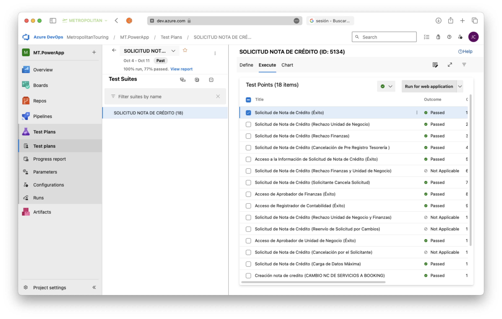
</step>
<step>
    
Se nos abrirá una ventana donde podremos ver los pasos que debemos seguir para realizar la prueba

    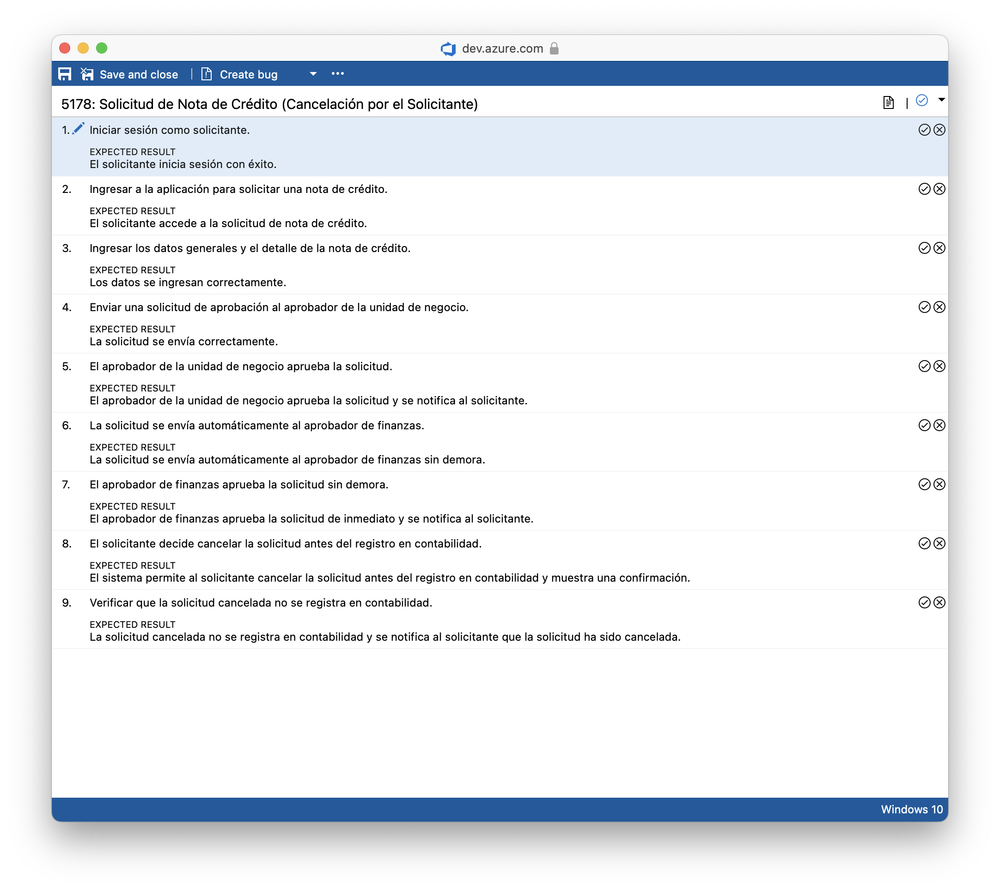
    
Desde esta ventana podremos ejecutar el test, marcarlo como aprobado o rechazado, y agregar un comentarios, además de poder generar bugs en caso de que el test falle

</step>
<step>
    
Una vez que el test ha sido ejecutado guardamos y debemos ejecutar toda la suite de pruebas 

</step>
</procedure>

