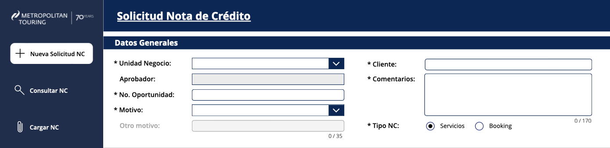
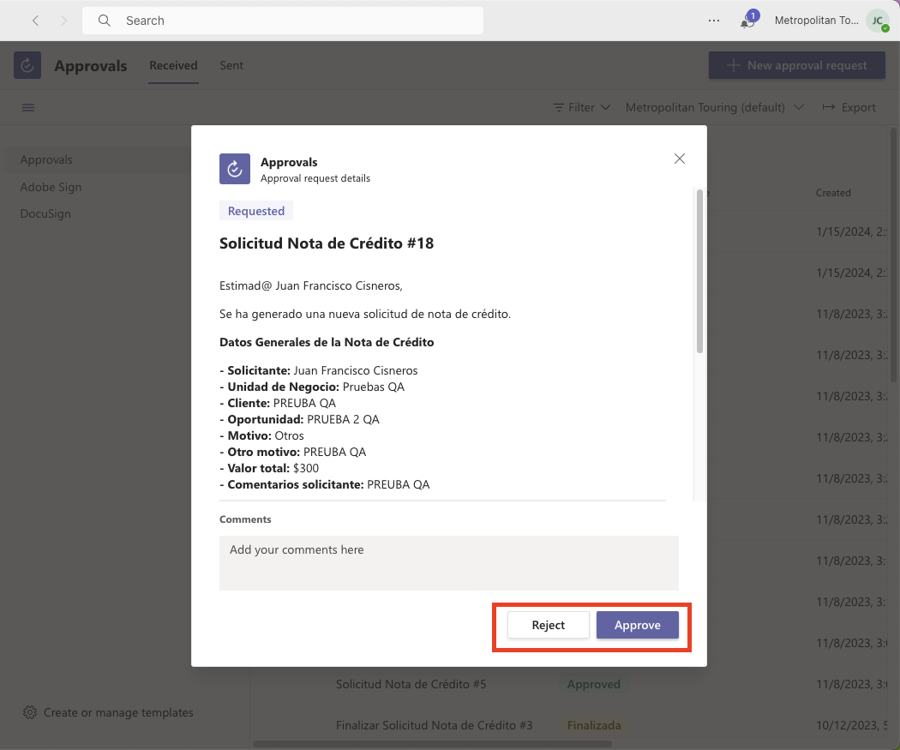

# Crear Nota de Crédito Perú

<procedure>
    <step>
        
<a href="#intro">Introducción</a>

    </step>
    <step>
        
<a href="#crear">Crear y enviar la Nota de Crédito</a>

    </step>
    <step>
        
<a href="#aprobar">Aprobar o Rechazar Nota de Crédito</a>

    </step>
    <step>
        
<a href="#sharepoint">SharePoint Base de Datos</a>

    </step>

</procedure>

## Introducción {id="intro"}

Esta es una guía para crear una Nota de Crédito en el sistema de Perú. La app consta de varios procesos
que se deben seguir para crear una Nota de Crédito. Estos procesos se encuentran en el siguiente orden:
1. Crear y enviar la Nota de Crédito
2. Aprobar o Rechazo de la Nota de Crédito (Existen varias aprobaciones por área)
3. Descargar Nota de Crédito en el idioma correspondiente

## Crear y enviar la Nota de Crédito {id="crear"}
[Iniciar Sesión](https://apps.powerapps.com/play/e/default-2a967794-c4d1-4bc2-8036-1a5201a5d767/a/fb550e6a-807f-4f1d-9d30-3e919b9a6a43?tenantId=2a967794-c4d1-4bc2-8036-1a5201a5d767&hint=23295a47-e9f9-4c4e-9cf4-43d1b2bdd16c&sourcetime=1697120679095)
<procedure>
    <step>
        
Acceso a la app: Inicie sesión en la app y navegue hasta la sección de Nueva Solicitud NC.

    </step>
    <step>
        
Crear una nueva solicitud: En la interfaz de la app, rellene los campos necesarios para crear una nueva solicitud.

        
        <warning>
            
Los comentarios y motivos deben ser lo más detallados posibles 

        </warning>
        <warning>
            
Es posible selecionar entre dos tipos de solicitud: Por Servicio (varios SKU del Booking) o Por Booking completo (Monto total del booking).

        </warning>
    </step>
</procedure>

### Nota de Crédito por Booking completo
En caso de hacer la solicitud por el monto total del booking, se debe ingresar el monto total del booking y asignarlo.
<procedure>
    <step>
        
 Ingresar el monto total del booking 

        
    </step>
    <step>
        
 Asignar el monto total del booking 

        
    </step>
    <step>
        
 Enviar la solicitud dando click en Finalizar

        
    </step>
    <step>
        
Podremos verificar el estado de la nota de crédito en el menú "Consultar NC"

        
        <warning>
            
El estado de la nota de crédito puede ser: 

            
1. Pendiente 

            
2. Pre-Aprobada 

            
3. Aprobada 

            
4. Pre-Registrada 

            
5. Finalizada 

            
5. Rechazada 

            
6. Cancelada 

        </warning>
    </step>
    <step>
        
Verificar que el email automático de aprobación o rechazo haya llegado cada x tiempo

    </step>
</procedure>

## Aprobar Nota de Crédito {id="aprobar"}

Para aprobar una nota de crédito el proceso se lo puede realizar desde el correo o instalando la extensión de Teams Approvals.
En este caso el proceso se lo realizará desde el app de Teams.

<procedure>
    <step>
        
Como aprobador ingresar a la app de Teams y buscar la extensión de Approvals

        <a href="https://teams.microsoft.com/l/app/7c316234-ded0-4f95-8a83-8453d0876592?source=app-details-dialog">Descargar extensión</a>
    </step>
    <step>
        
Una vez instalada la extensión, ingresar a la extensión y buscar la solicitud de aprobación

        
    </step>
    <step>
        
Se nos despliega la ventana de la solicitud donde podremos aprobar o rechazar la solicitud

        
        <warning>
            
En algunos casos como aprobadores deberemos ingresar un comentario para aprobar o rechazar la solicitud, estos comentarios pueden ser
                tan genéricos como un "OK" o tan detallados como el #NC/TC en el caso de Tesorería.
 
        </warning>
    </step>
    <step>
        
Click en approve o reject 

        
    </step>

</procedure>

## Descargar la Nota de Crédito {id="descargar"}
En caso de que la solicitud haya sido FINALIZADA, se debe descargar la nota de crédito en el idioma correspondiente.
<procedure>
    <step>
        
 Ingresar a la app y buscar la solicitud FINALIZADA en Consultar NC 

        
    </step>
    <step>
        
 Click en el botón del idioma en el que se descarga la nota 

        
        <warning>
            
Este proceso puede tardar unos minutos

        </warning>
    </step>
    <step>
        
 Ver adjuntos 

        
    </step>
    <step>
        
 Se descargará un archivo PDF con la nota de crédito 

        
        
    </step>
</procedure>

## SharePoint Base de Datos {id="sharepoint"}

Esta es una sección que es manejada únicamente por el equipo de Sistemas.

En este link podremos acceder a la base de datos de Sharepoint donde se almacenan las notas de crédito, roles y usuarios.
 [Ir al SharePoint](https://mt.sharepoint.com/app/pe-notasdecredito/Lists/App_NC_Aprobadores/AllItems.aspx)

