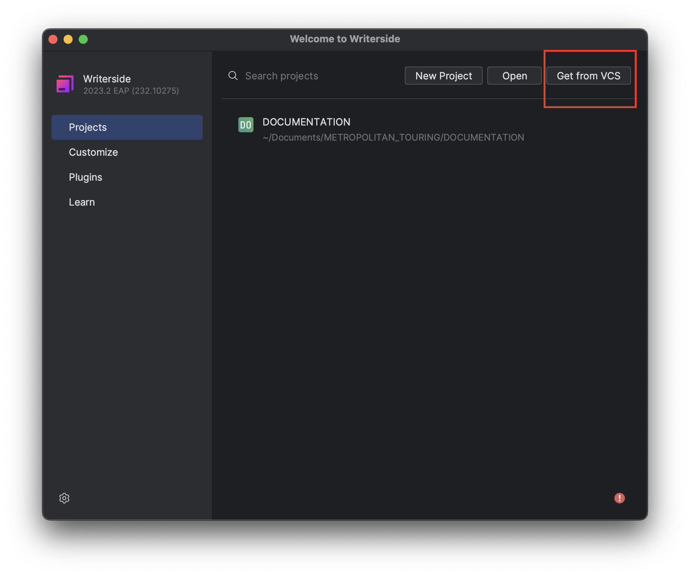
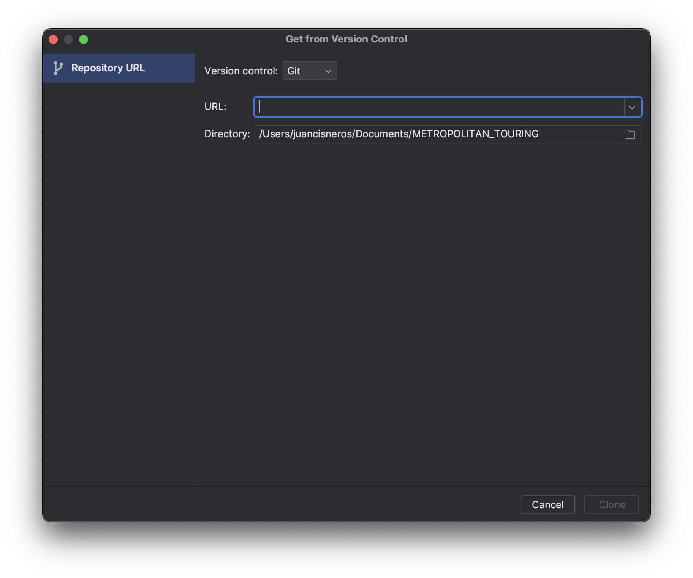
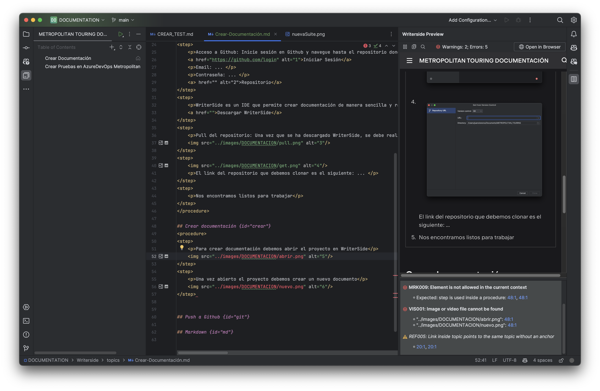
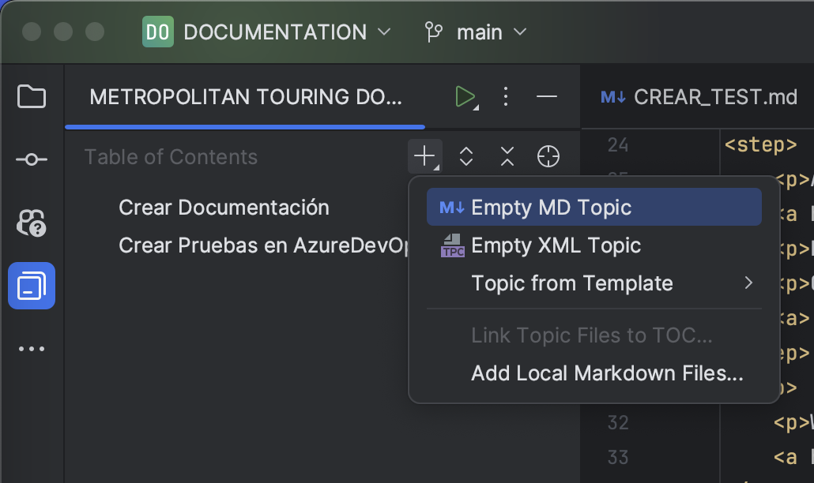
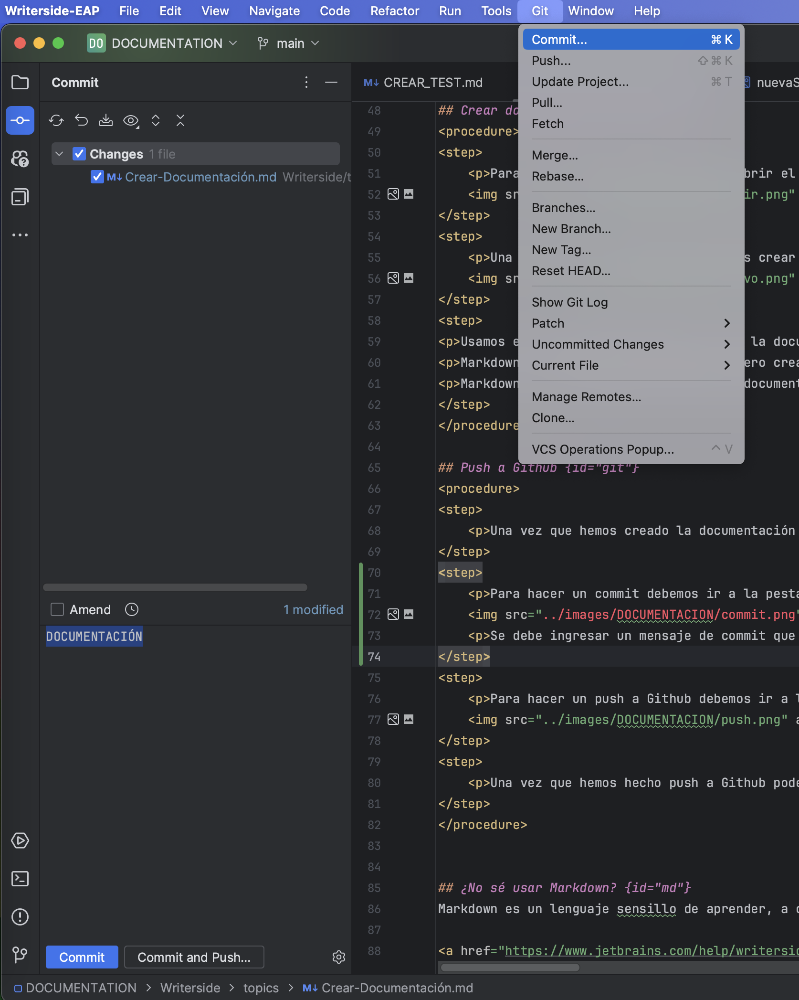
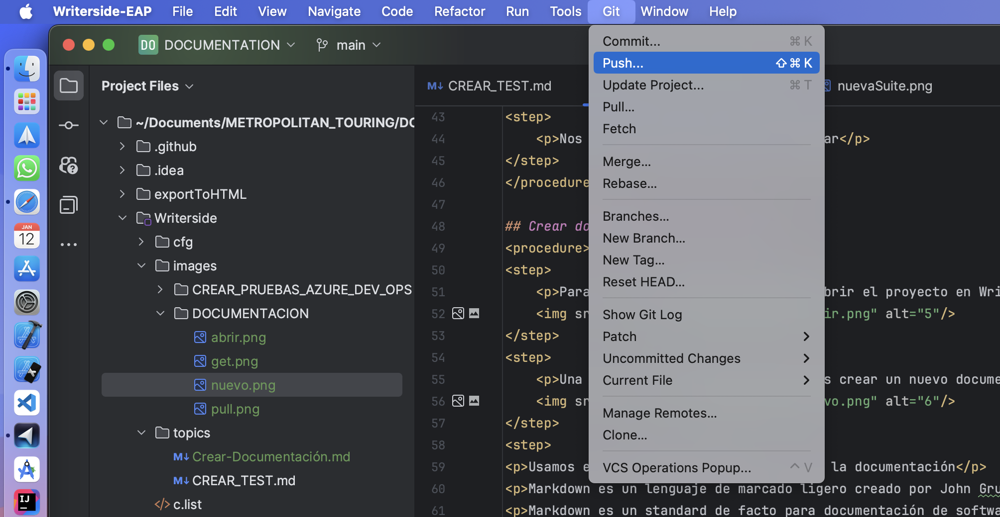

# Crear Documentacion

## Índice de Contenidos
<procedure>
    <step>
        
<a href="#intro">Documentación Introducción</a>

    </step>
    <step>
        
<a href="#crear">Crear documentación</a>

    </step>
    <step>
        
<a href="#git">Push a Github</a>

    </step>
    <step>
        
<a href="#md">¿No sé usar Markdown?</a>

    </step>

</procedure>

## Documentación Introducción {id="intro"}
La documentación es una parte fundamental en el desarrollo de software, ya que permite a los desarrolladores y a los usuarios entender el funcionamiento de un sistema. En este caso, la documentación se encuentra en un repositorio de Github, el cual permite a los desarrolladores y usuarios acceder a la documentación de manera sencilla y rápida.

<procedure>
<step>
    
Acceso a Github: Inicie sesión en Github y navegue hasta el repositorio donde se replica este proyecto.

    <a href="https://github.com/login" alt="1">Iniciar Sesión</a>
    
Email: ... 

    
Contraseña: ... 

    <a> href="" alt="2">Repositorio</a>
</step>
<step>
    
WriterSide es un IDE que permite crear documentación de manera sencilla y rápida. 

    <a href="">Descargar WriterSide</a>
</step>
<step>
    
Pull del repositorio: Una vez que se ha descargado WriterSide, se debe realizar un pull del repositorio para obtener el proyecto y modificarlo.

    
</step>
<step>
    
    
El link del repositorio que debemos clonar es el siguiente: ... 

</step>
<step>
    
Nos encontramos listos para trabajar

</step>
</procedure>

## Crear documentación {id="crear"}
<procedure>
<step>
    
Para crear documentación debemos abrir el proyecto en WriterSide

    
</step>
<step>
    
Una vez abierto el proyecto debemos crear un nuevo documento y comenzar a editarlo

    
</step>
<step>

Usamos el lenguaje Markdown para crear la documentación

Markdown es un lenguaje de marcado ligero creado por John Gruber que trata de conseguir la máxima legibilidad y facilidad de publicación tanto en su forma de entrada como de salida, inspirándose en muchas convenciones existentes para marcar mensajes de correo electrónico usando texto plano.

Markdown es un standard de facto para documentación de software

</step>
</procedure>

## Push a Github {id="git"}
<procedure>
<step>
    
Una vez que hemos creado la documentación debemos hacer un commit and push a Github

</step>
<step>
    
Para hacer un commit debemos ir a la pestaña de Git y hacer click en el botón de Commit

    
    
Se debe ingresar un mensaje de commit que detalle lo que se agregó o modificó

</step>
<step>
    
Para hacer un push a Github debemos ir a la pestaña de Git y hacer click en el botón de Push

    
</step>
<step>
    
Una vez que hemos hecho push a Github podemos ver los cambios en el repositorio y se ejecuta automáticamente un GitAction para publicar la web

</step>
</procedure>

## ¿No sé usar Markdown? {id="md"}
Markdown es un lenguaje sensillo de aprender, a continuación se presenta una guía de Markdown para que puedas aprender a usarlo en pocos minutos.

<a href="https://www.jetbrains.com/help/writerside/markup-reference.html#semantic">Más información sobre Markdown</a>