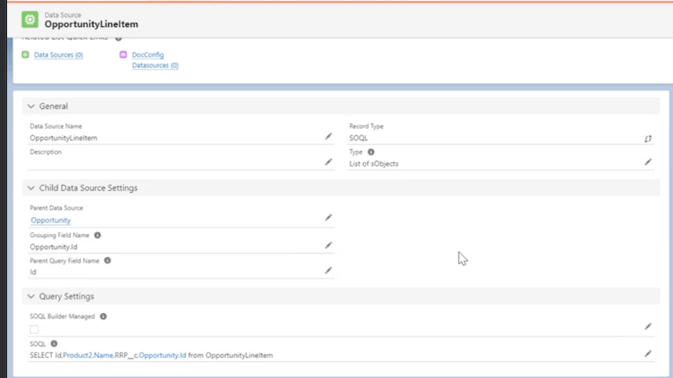

# PDF Butler

<procedure>
    <step>
        
<a href="#intro">Documentación Introducción</a>

    </step>
    <step>
        
<a href="#crear">Crear un DataSource</a>

    </step>
    <step>
        
<a href="#config"> Configurar el Documento</a>

    </step>
    <step>
        
<a href="#salesforce"> Cómo usarlo en Salesforce</a>

    </step>
</procedure>

## Documentación Introducción {id="intro"}

PDF Butler es una herramienta de Salesforce que permite crear documentos PDF de manera sencilla y rápida. En este caso, la documentación se encuentra en 
su página oficial, la cual permite a los desarrolladores y usuarios acceder a la documentación de manera sencilla y rápida.
<a href="https://www.pdfbutler.com/academy.html">Ir a la Documentación</a>

En este documento se detalla de manera sencilla y rápida el uso de PDF Butler en el ambiente de Salesforce.

## Uso PDF Butler {id="crear"}

Es necesario saber que PDF Butler es una herramienta basada en SQL, por lo que es necesario tener conocimientos básicos de SQL para poder utilizarla. 

<procedure>
    <step>
        
Abrir el completo en SalesForce

        
        
La página principal muestra videos documentales de la app

    </step>
    <step>
        
Para crear un nuevo documento debemos ir a la sección de "Data Sources" -> New

        
    </step>
    <step>
        
Seleccionamos SOQL

        
    </step>
    <step>
        
Rellenamos los datos como Data Source Name, Description ... 

        
        <warning>
            
Normalmente utilizamos como Type: List of sObjects

        </warning>
        <warning>
            
El Apartado de Data Child Source Settings es para cuando queremos crear un documento que tenga un subdocumento, aquí van entonces las relaciones
            entre los objetos de tipo Data Source

        </warning>
    </step>
    <step>
        
En el apartado de SOQL Query debemos ingresar la consulta SQL que queremos realizar

        
    </step>
    <step>
        
Guardamos el Data Source

    </step>
    <step>
        
Llegados a este punto, deberíamos ser capaces de comenzar a generar el PDF o archivo Word, pero normalmente
        requerimos de más Data Sources para crear relaciones, para este ejemplo se crea un Data Source extra que se muestra aquí

        
        <warning>
            
Como se puede ver en la imagen el DataSource hace referencia a otro DataSource(Opportunity), agrupando por
                Opportunity.Id y filtrando por el Id de la Opportunity que se está visualizando

        </warning>
    </step>
</procedure>

## Configurar el Documento {id="config"}

Aquí es donde se unen las consultas SQL con el documento que se quiere generar, para este ejemplo se va a generar un documento
en formato Word

<procedure>
    <step>
        
Vamos a la sección Doc Configs -> New (Por recomendación crear como Main Word Document)

        
    </step>
    <step>
        
Rellenamos el nombre de documento, título, descripción y siempre generamos el tipo de Delivery Option como Attachment

        
    </step>
    <step>
        
Click en Save y abrimos el editor

        
    </step>
    <step>
        
Comenzamos a elegir los Data Sources que queremos utilizar

        
    </step>
    <step>
        
Al elegir un Data Source se nos despliega un menú con los campos que podemos utilizar

        
        <warning>
            
Si las consultas fueron correctamente realizadas, los campos deberían aparecer en el menú

        </warning>
    </step>
    <step>
        
Click en OK

    </step>
    <step>
        
 De igual forma si las relaciones entre Data Sources fueron correctamente realizadas, cuando presionamos sobre New Child 

        
        
    </step>
    <step>
        
Ahora podemos configurar el documento como queramos, agregando campos, imágenes, tablas, etc.

        
        <warning>
            
Lo correcto es partir de un documento word con el formato preparado por ejemplo:

            
        </warning>
    </step>
    <step>
        
Ahora vamos a ver como se configura una tabla, la tabla que vemos arriba de Word

        
        
Podemos ver que se ingresa un nombre, el tipo que es un TABLE_ROW, el DataSource y el MergeField que es el campo que queremos mostrar OPP en el Word

    </step>
    <step>
        
Vamos a crear tantos ConfigTypes como necesitemos, en este caso la siguiente row se ve así

        
        
Podemos ver que como estamos creando la tabla el nombre es el lo que antes era el MergeField, el tipo es SINGLE y el DataSource es configurable como queramos, el DataSourceField en este caso es el ID de la Opportunity y finalmente el MergeField también es OPP

        <warning>
            
Así es como nos va quedando entonces el árbol

            
        </warning>
        <warning>
            
Es importante que el MergeField del Table Row no se llama igual al primer campo de la tabla da problemas

        </warning>
    </step>
    <step>
        
Debemos ir configurando el documento como queramos, antes de continuar 

        <warning>
            
Para el ejemplo que estamos haciendo los campos quedan así

            
            
Para el ejemplo que estamos haciendo el PDF queda de esta manera

            
        </warning>
    </step>
    <step>
        
Una vez que hemos terminado de configurar el documento debemos ir a la sección de "Doc Config Documents" y subir el Word que hemos configurado

        
    </step>
    <step>
        
Ahora damos en Save to Server donde nos vamos a dar cuenta si el proceso es o no exitoso

        
        <warning>
            
Si el proceso es exitoso, vemos un indicador verde

        </warning>
    </step>
    <step>
        
Ahora podemos descargar el documento, Test Conversion 

        
    </step>
    <step>
        
Descargamos por ejemplo en formato DOCX

        
    </step>
</procedure>

## Cómo usarlo en Salesforce {id="salesforce"}

El ID que devuelve el objeto en PDF Butler es clave para poder utilizarlo en Salesforce

<procedure>
    <step>
        
Podemos obtener el ID del link del objeto

        
    </step>
    <step>
        
Regresamos a Metropolitan Touring en la sección de Apps

        
    </step>
    <step>
        
Vamos a un objeto donde queramos agregar el reporte, en este caso una oportunidad, en la parte inferior vemos que se encuentra el plugin de PDF Butler

        
    </step>
    <step>
        
Para agregar una nueva sección debemos dar click en el botón de configuración -> Edit Page

        
        
    </step>
    <step>
        
Arrastramos el componente de PDF Butler a la sección que queramos

        
    </step>
    <step>
        
Configuramos el componente, ingresando el ID que obtuvimos anteriormente

        
        <warning>
            
Podemos configurar filtros, emails automáticos, etc.

        </warning>
    </step>
    <step>
        
Guardamos y activamos la página

    </step>
    <step>
        
Probamos viendo la oportunidad y la nueva sección que hemos creado

        
    </step>
    <step>
        
Podemos ver que el documento se ha generado correctamente

        <warning>
            
Si el documento no se genera correctamente, debemos revisar los Data Sources y el documento, además la consola

        </warning>
    </step>
</procedure>
