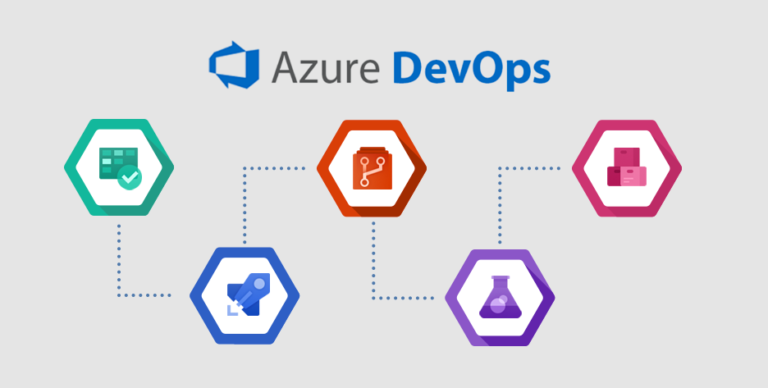

# Crear Pruebas en AzureDevOps Metropolitan Touring QA

## Índice de Contenidos

<procedure>
    <step>
        
<a href="#devops-intro">DevOps Introducción</a>

    </step>
    <step>
        
<a href="#quedevops">Qué son los tests en Azure DevOps</a>

    </step>
    <step>
        
<a href="#devops-crear">Crear un Test en Azure DevOps</a>

    </step>
    <step>
        
Crear Tests masivos en Azure DevOps

    </step>
</procedure>

## DevOps Introducción {id="devops-intro"}
Azure DevOps es un conjunto de servicios que permite a los equipos de desarrollo y operaciones compartir código, 
realizar un seguimiento del trabajo y enviar software; todo en un solo lugar. Azure DevOps incluye repositorios de Git 
privados, un sistema de compilación CI/CD, tableros Kanban, seguimiento de problemas y mucho más.

En Metropilitan Touring QA, utilizamos Azure DevOps para crear y ejecutar pruebas automatizadas, además revisar los
resultados de las pruebas y generar reportes de los mismos.

Por otro lado QA utiliza Azure DevOps para revisar estados de los bugs, crear bugs, asignar bugs, etc.

Finalmente QA es también responsable de crear historias de usuario y tareas en Azure DevOps cuando se levantan procesos.

## Qué son los tests en Azure DevOps {id="quedevops"}
Los tests en Azure DevOps son un conjunto de pasos que se ejecutan en un ambiente de Azure DevOps, los cuales pueden
ser ejecutados de forma manual o automática.

Hoy en día en Metropolitan Touring QA, se utilizan los tests de Azure DevOps para ejecutar pruebas manuales, que son
ejecutadas por los testers de QA. Estos tests validan que los procesos, apps y/o funcionalidades de los sistemas de
Metropolitan Touring funcionen correctamente. Y todos los tests deben encontrarse en estado "Passed" para que una funcionalidad
pueda ser liberada a producción.

En caso de que el test falle, el tester de QA debe crear un bug en Azure DevOps, y asignarlo al equipo de desarrollo
para que lo resuelva. El equipo de desarrollo es quien debe cambiar el estado del bug a "Resolved for QA" y asignarlo al tester de QA para que lo valide.
Una vez que el bug es resuelto, el tester de QA debe ejecutar nuevamente TODOS los test y verificar que el bug haya sido resuelto.

Nota: Es importante identificar el siguiente logo, ya que se utiliza para identificar los tests en Azure DevOps. Más adelante
se muestra la interfaz de Azure DevOps y se explica cómo crear un test paso a paso.

{ width="400px" }{border-effect=line}

## Inject XML
For example, this is how you inject a procedure:

<procedure title="Inject a procedure" id="inject-a-procedure">
    <step>
        
Start typing and select a procedure type from the completion suggestions:

        
    </step>
    <step>
        
Press <shortcut>Tab</shortcut> or <shortcut>Enter</shortcut> to insert the markup.

    </step>
</procedure>

## Add interactive elements

### Tabs
To add switchable content, you can make use of tabs (inject them by starting to type `tab` on a new line):

<tabs>
    <tab title="Markdown">
        <code-block lang="plain text">{ width=450 }</code-block>
    </tab>
    <tab title="Semantic markup">
        <code-block lang="xml">
            <![CDATA[]]></code-block>
    </tab>
</tabs>

### Collapsible blocks
Apart from injecting entire XML elements, you can use attributes to configure the behavior of certain elements.
For example, you can collapse a chapter that contains non-essential information:

#### Supplementary info {collapsible="true"}
Content under a collapsible header will be collapsed by default,
but you can modify the behavior by adding the following attribute:
`default-state="expanded"`

### Convert selection to XML
If you need to extend an element with more functions, you can convert selected content from Markdown to semantic markup.
For example, if you want to merge cells in a table, it's much easier to convert it to XML than do this in Markdown.
Position the caret anywhere in the table and press <shortcut>Alt+Enter</shortcut>:

## Feedback and support
Please report any issues, usability improvements, or feature requests to our
<a href="https://youtrack.jetbrains.com/newIssue?project=WRS">YouTrack project</a>
(you will need to register).

You are welcome to join our
<a href="https://jb.gg/WRS_Slack">public Slack workspace</a>.
Before you do, please read our [Code of conduct](https://plugins.jetbrains.com/plugin/20158-writerside/docs/writerside-code-of-conduct.html).
We assume that you’ve read and acknowledged it before joining.

You can also always email us at [writerside@jetbrains.com](mailto:writerside@jetbrains.com).

<seealso>
    <category ref="wrs">
        <a href="https://plugins.jetbrains.com/plugin/20158-writerside/docs/markup-reference.html">Markup reference</a>
        <a href="https://plugins.jetbrains.com/plugin/20158-writerside/docs/manage-table-of-contents.html">Reorder topics in the TOC</a>
        <a href="https://plugins.jetbrains.com/plugin/20158-writerside/docs/local-build.html">Build and publish</a>
        <a href="https://plugins.jetbrains.com/plugin/20158-writerside/docs/configure-search.html">Configure Search</a>
    </category>
</seealso>